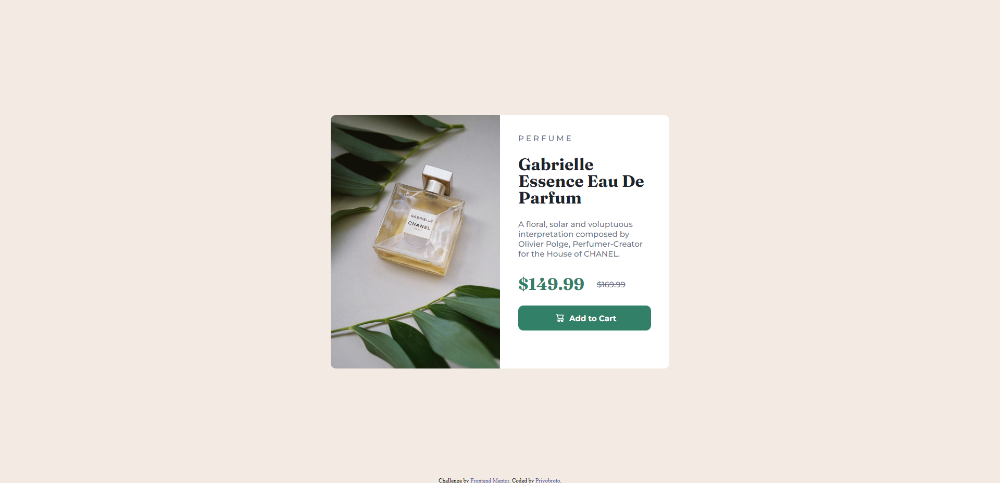

# Frontend Mentor - Product preview card component solution

This is a solution to the [Product preview card component challenge on Frontend Mentor](https://www.frontendmentor.io/challenges/product-preview-card-component-GO7UmttRfa). Frontend Mentor challenges help you improve your coding skills by building realistic projects. 

## Table of contents

- [Overview](#overview)
  - [Screenshot](#screenshot)
  - [Links](#links)
- [Author](#author)

**Note: Delete this note and update the table of contents based on what sections you keep.**

## Overview

### Screenshot

### Links

- Solution URL: [Add solution URL here](https://github.com/PriyoBROTO04/Frontend-Mentor-Projects/tree/main/Project%202)
- Live Site URL: [Add live site URL here](https://priyobroto04.github.io/Frontend-Mentor-Projects/Project%202/index.html)

## Author

- Website - [Priyobroto Kar](https://priyobroto04.github.io/MySite/)
- Frontend Mentor - [@PriyoBROTO04](https://www.frontendmentor.io/profile/PriyoBROTO04)
- Twitter - [@PriyobrotoKar](https://twitter.com/PriyobrotoKar)
